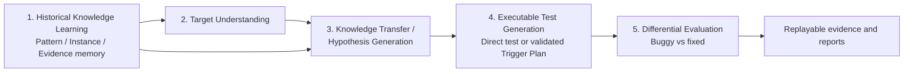

# Architecture

The repository is organized around the proposed history-guided transfer pipeline. The diagram separates the original contribution—structured historical knowledge for mechanism targeting—from the later Trigger Plan refinement.



## Stage 1 — Historical Knowledge Learning

The proposed knowledge layer separates three complementary concepts:

- **Pattern memory:** recurring failure mechanisms, preconditions, trigger shapes, and expected invariants abstracted across cases.
- **Instance memory:** concrete historical bugs with issue context, fix evidence, observed failure, and repository provenance.
- **Evidence memory:** source references, diffs, regression behavior, oracle provenance, and confidence for each claim.

**Implemented in the current POC:** prepared raw and structured historical records in `data/`, including mechanism-oriented fields and provenance/evidence references.

**Partially implemented:** structured records are usable by the prompts, but the selected history is retrospective and there is no learned retriever or autonomous memory update.

**Proposed future extension:** evaluate history selection and structured knowledge construction on independently selected targets without exposing evaluator-only target truth.

## Stage 2 — Target Understanding

Target understanding builds a bounded context from the buggy checkout and visible runtime facts. The leakage manifest separates agent-visible inputs from evaluator-only truth, fixed source, issue metadata, patch metadata, and hidden regression tests.

**Implemented in the current POC:** target-context preparation, leakage manifests, visible-file checks, and target adapter configuration.

**Partially implemented:** the context is a selected transfer-feasibility slice rather than a general repository-understanding system.

**Proposed future extension:** measure context-selection quality separately from historical transfer.

## Stage 3 — Knowledge Transfer / Hypothesis Generation

The three controlled strategies are:

- **A — Target only:** target context without history.
- **B — Raw history:** target context plus raw historical issue material.
- **C — Structured history:** target context plus the same historical cases represented as mechanism-level knowledge and applicability-aware evidence.

This stage produces a hypothesis with a possible failure mechanism, trigger idea, expected invariant, and target-supported oracle. Hypotheses are frozen before executable test generation.

**Implemented in the current POC:** A/B/C prompt contracts, raw/structured history inputs, frozen hypotheses, and machine-readable Experiment 2 evidence.

**Partially implemented:** the structured-history records are prepared rather than learned, and the current target is one retrospectively selected transfer-feasibility case.

## Stage 4 — Executable Test Generation

This stage translates a frozen mechanism hypothesis into a concrete precondition, state setup, action sequence, observable, and assertion. Direct generation is the baseline path.

The strict **Trigger Plan** is a later engineering improvement inside this stage. It adds a contract for those fields, deterministic validation, bounded repair, candidate diversity, and plan-to-test generation. It is not the main history-guided contribution.

**Implemented in the current POC:** direct test generation, preflight checks, strict Trigger Plan validation, bounded repair, test hashing, and preserved generated artifacts.

**Partially implemented:** Trigger Plans improve plan validity and hypothesis coverage in the selected Experiment 4 evidence, but direct generation remains more efficient per generated test and the planner is evaluated on the selected case.

**Proposed future extension:** improve observable/assertion alignment and trigger validity on a newly specified held-out set while keeping the evaluator frozen.

## Stage 5 — Differential Evaluation

The evaluator executes the unchanged generated test on the buggy and fixed revisions. The strongest signal is:

```text
T(B) = FAIL
T(F) = PASS
```

A semantic failure must be distinguished from syntax, import, setup, or unrelated environment failure. The evaluator owns this policy; generation and replay do not change it.

**Implemented in the current POC:** buggy/fixed execution, semantic classification, verified F2P checks, execution logs, replayable evidence, and deterministic report generation.

**Partially implemented:** the harness is one selected BugsInPy target and offline replay validates preserved evidence rather than rerunning every historical generation.

## Runtime boundaries

- `RunConfig` versions model, planner, target, execution, paths, and evaluator settings.
- The application pipeline coordinates stages but does not receive evaluator-only truth.
- The target adapter owns checkout and runtime details.
- The executor owns subprocess lifecycle, timeouts, exit codes, and normalized logs.
- `BenchmarkEvaluator` owns buggy/fixed semantics.
- The artifact store preserves immutable hypotheses, plans, tests, executions, classifications, and hashes.
- The offline replay path reads preserved manifests and row snapshots; it does not instantiate an LLM provider.

## Current flow

`LOAD_CONFIG → PREPARE_TARGET → LOAD_HISTORY → LOAD_OR_GENERATE_HYPOTHESIS → FREEZE_HYPOTHESIS → GENERATE_TRIGGER_PLAN (optional) → VALIDATE_TRIGGER_PLAN (optional) → GENERATE_TEST → PREFLIGHT_TEST → EXECUTE_BUGGY → EXECUTE_FIXED → EVALUATE → PERSIST → REPORT`

The optional Trigger Plan steps are downstream of history-guided hypothesis generation. They do not replace the A/B/C comparison.
