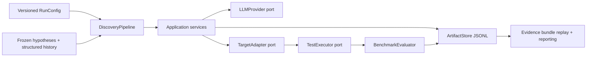

# Architecture

## Boundaries

- Domain models are immutable where they represent evidence and carry schema
  versions, stable identifiers, provenance, and hashes.
- Prompt builders expose explicit strategies: `direct_test_v1`,
  `strict_trigger_plan_v1`, and `plan_to_test_compact_v1`.
- The target adapter owns checkout paths, interpreter selection, runner choice,
  environment, and source-path markers.
- The executor owns subprocess lifecycle, normalized logs, timeouts, exit codes,
  and cleanup of injected tests.
- `BenchmarkEvaluator` owns the preserved buggy/fixed revision semantics. The
  discovery pipeline can instead use `FindingValidator` when no fixed revision
  exists.
- The artifact store is append-only and refuses duplicate events or writes after
  a completed run. Immutable artifacts are hash-checked when a run resumes.
- The provider registry honors `model.provider`; unsupported values fail before a
  run starts. Replay, evaluation, and reporting do not construct a provider.
- All config-relative input and target paths are resolved from the
  config/repository root, not the caller's working directory.

## Stage flow

`LOAD_CONFIG → PREPARE_TARGET → LOAD_HISTORY → LOAD_OR_GENERATE_HYPOTHESIS →
FREEZE_HYPOTHESIS → GENERATE_TRIGGER_PLAN → VALIDATE_TRIGGER_PLAN →
GENERATE_TEST → PREFLIGHT_TEST → EXECUTE_BUGGY → EXECUTE_FIXED → EVALUATE →
PERSIST → REPORT`

Resume mode indexes the ledger by hypothesis and candidate. It reuses the
persisted test artifact after generation, continues at the first missing
preflight/execution/evaluation/persistence stage, reconstructs the summary from
the complete ledger, and appends no duplicate terminal evaluation record. A
completed run is never silently overwritten.

## Runtime modes

Live discovery uses the configured provider and target adapter. Deterministic
evidence replay validates a versioned per-arm manifest and its co-located row
snapshot; it is not re-execution against the target repositories. Benchmark
evaluation is the preserved buggy/fixed evaluator, and report generation
serializes its validated aggregate.
